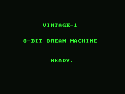
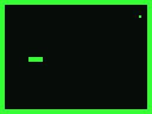
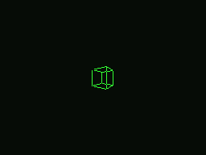
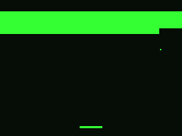

# VINTAGE-1

<p align="center">
  
  
  
  
</p>

A fantasy 8-bit home computer, built from the silicon up: a cycle-counted
NMOS 6502 CPU core, an assembler, a disassembler, a machine model, demo
software written in 6502 assembly, and a browser console — all in one Rust
workspace with zero runtime dependencies.

## Why

Modern machines are black boxes. VINTAGE-1 is small enough to hold the
*entire* machine in your head: 16 KB of RAM, a 1-bit framebuffer, a beeper,
and one interrupt-worthy keyboard register. Every gate is externally
verified: the CPU passes the Klaus Dormann 6502 functional test suite, and
every demo is pixel-checked against an independent reference rasterizer.

## Roadmap

- ☑ Full NMOS 6502 CPU core, Klaus Dormann functional-test verified
- ☑ 151-opcode encode table (inverse of the decoder, one source of truth)
- ☑ Two-pass assembler with expression grammar and zero-page sizing
- ☑ Disassembler with full assemble ⟷ disassemble roundtrip
- ☑ VINTAGE-1 machine model — 48K RAM, 6K framebuffer, 2 MHz / 33,333 cycles per frame
- ☑ Keyboard input (read-clears single-key buffer)
- ☑ Frame counter ($5802/$5803)
- ☑ Phosphor palette select ($5804: green / amber / white)
- ☑ LFSR random number register ($5805)
- ☑ Beeper sound channel ($5807, square wave via WebAudio in the console)
- ☑ CLI toolchain: `asm`, `run` (headless PPM dumps), `disasm`
- ☑ `.vin` ROM container format
- ☑ Web console (wasm): canvas blit, CPU state panel, cycle-budget slider, ROM loader
- ☑ Demo: hello — 8×8 font banner
- ☑ Demo: snake — playable, speed keys
- ☑ Demo: cube — rotating 3D wireframe
- ☑ Demo: tune — beeper melody with real audio
- ☑ Demo: breakout — the first demo combining input + video + sound
- ☑ Programmer's reference (`docs/REFERENCE.md`)
- ☑ Public GitHub repo with MIT license and author headers
- ☐ Per-demo cycle accounting in the console
- ☐ Banked ROM / multi-load cartridge format
- ☐ Hardware interrupts: NMI/IRQ vectors wired to vsync
- ☐ Sprite unit (2 hardware sprites with x/y latches)
- ☐ 2bpp color mode (selected via `$5804` high bit)
- ☐ Save states (`.vst` files, console load/save)
- ☐ In-browser assembler: paste source, run — no toolchain install

*This list is the living roadmap — [ROADMAP.md](ROADMAP.md) is the canonical copy.*

## Architecture

```
src/isa.rs     opcode encode/decode tables, 151 official opcodes
src/cpu.rs     NMOS 6502 core, cycle-counted, Bus abstraction
src/machine.rs VINTAGE-1 board: RAM, ROM, framebuffer, I/O registers
src/asm.rs     two-pass 6502 assembler, zero-copy zp/absolute sizing
src/dis.rs     disassembler (roundtrips all 151 opcodes)
src/wasm.rs    C-ABI console bridge (vin_* exports)
src/main.rs    CLI: vintage asm | run | disasm
console/       Vite + vanilla-TS frontend (CRT renderer, ROM picker, debugger)
```

## The Machine

| Region      | Range          | Notes                                     |
|-------------|----------------|-------------------------------------------|
| RAM         | $0000–$3FFF    | 16 KB work RAM                            |
| Framebuffer | $4000–$57FF    | 256×192 monochrome, 1 bit/pixel, MSB-left |
| I/O         | $5800–$5FFF    | see register table                        |
| ROM         | $E000–$FFFF    | 8 KB cartridge/executable space           |
| Vectors     | $FFFA–$FFFF    | NMI / RESET / IRQ                         |

### I/O registers

| Register | Read            | Write            |
|----------|-----------------|------------------|
| $5800    | keyboard (read clears) | —        |
| $5802    | frame counter (u16 LE, $5802/$5803) | — |
| $5804    | palette select  | palette select   |
| $5805    | LFSR random (read steps it) | —   |
| $5807    | beeper period (0 = silence) | beeper period |
| $5806+   | —               | reserved         |

## Software

- `software/hello.s` — banner text via an 8×8 font table
- `software/snake.s` — playable snake on the 256×192 playfield (arrows/wasd)
- `software/cube.s` — a rotating 3D wireframe cube: rotation-matrix table,
  12 Bresenham edges, double-buffer clean-frame erase
- `software/cube_table.py` — generates the 32-phase rotation table
- `software/tune.s` — a 32-note beeper melody: a period table indexed per
  note, frame-paced through $5807 (the console plays actual audio)
- `software/breakout.s` — playable breakout: 32 bricks as bitmask bytes, a
  sliding 32-px paddle, a 2×2 ball with wall/paddle/brick bounces, and a
  per-event beeper blip decaying through $5807

## Build & Run

Prereqs: Rust (stable + wasm32-unknown-unknown), node ≥ 18.

```bash
# CLI + emulator toolchain
cargo test                       # 79 tests (unit + integration), Klaus gate included
cargo run -- cube.s --frames 120 # run a demo for 2 seconds, PPM to stdout
cargo run -- asm software/cube.s -o cube.vin
cargo run -- disasm cube.vin
```

```bash
# Web console
cargo build --target wasm32-unknown-unknown --release --lib
cp target/wasm32-unknown-unknown/release/vintage.wasm console/public/
(cd console && npm install && npm run dev)
```

## Verification

- Klaus Dormann functional test reaches the success trap (test klaus.rs)
- 60 raster diffs: 5 rotations × 12 edges of the cube vs an independent
  reference rasterizer (tests/draw_probe.rs)
- assembler/disassembler: all 151 official opcodes roundtrip
- demo smoke tests render live pixels per ROM (tests/demos.rs)
